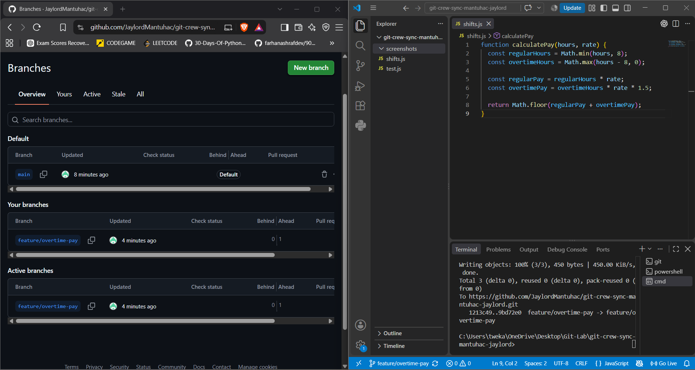
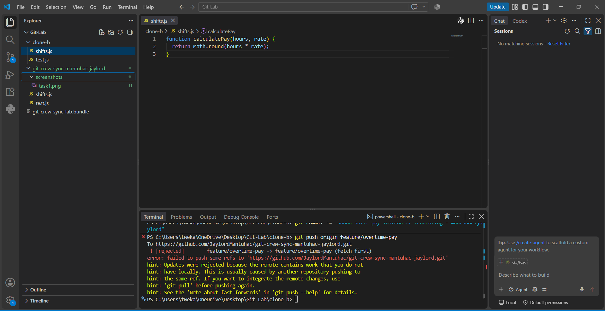
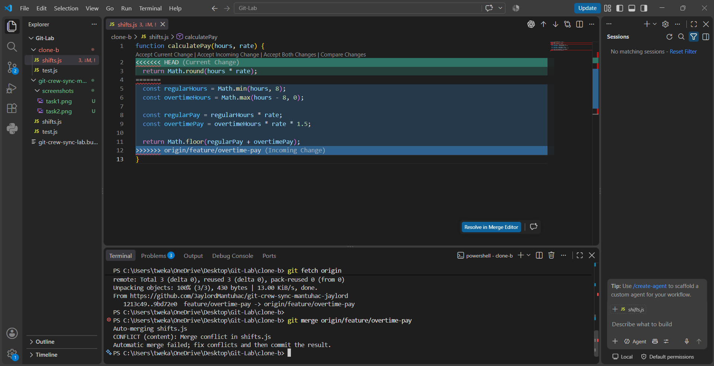
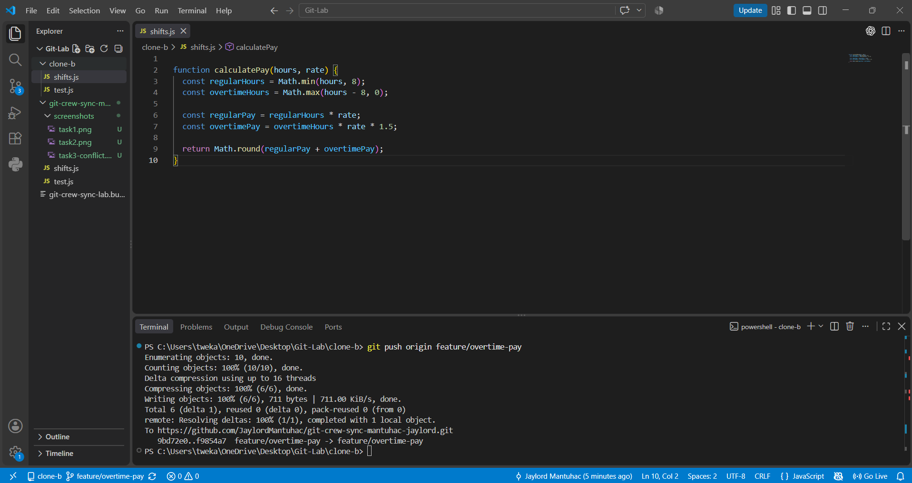
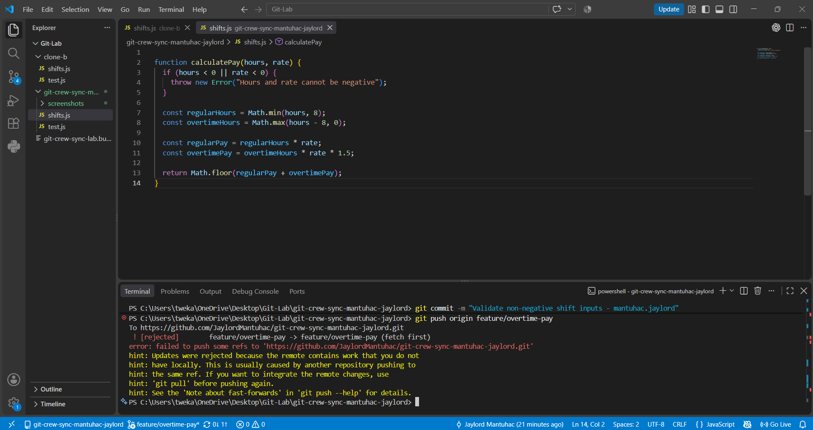
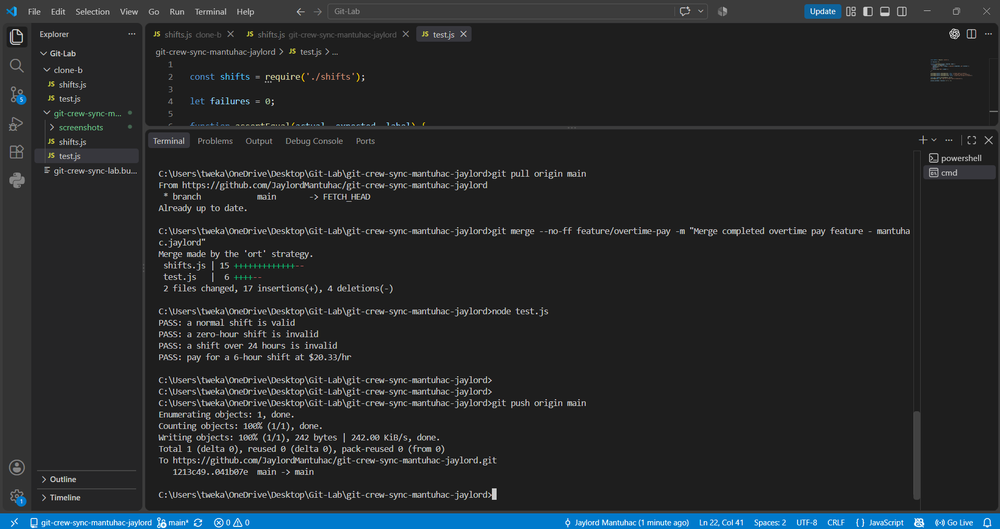
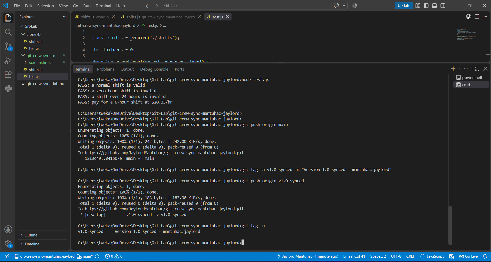

# Crew Sync: Shift Scheduler Git Workflow

**Name:** Jaylord Mantuhac  
**Repository:** git-crew-sync-mantuhac-jaylord

## Task 1 — Push from Clone A

I updated `calculatePay()` to pay time-and-a-half for hours worked beyond eight hours. I committed the change on `feature/overtime-pay` and pushed it from Clone A.

## Task 2 — Diverge from Clone B

In Clone B, I changed `calculatePay()` to round pay instead of truncating it. My push was rejected because Clone A had already pushed a commit that Clone B did not have.

## Task 3 — Reconcile with a Merge

I fetched the remote changes in Clone B and merged them into my local feature branch. I resolved the conflict by keeping both overtime pay and rounding, then pushed the merged result.

## Task 4 — Reconcile with a Rebase

In Clone A, I added validation to reject negative hours and rates. My push was rejected because Clone B had pushed newer changes. I fetched the remote branch and rebased my local commit onto it.

The rebase completed without a conflict. I then restored the original `isValidShift()` function and module exports, updated the outdated rounding test, confirmed that all four tests passed, and pushed the corrected feature branch without force.

## Task 5 — Merge into Main

I merged the completed feature branch into `main`, ran the tests successfully, and pushed `main` to GitHub.

## Task 6 — Tag the Final Version

I created the annotated tag `v1.0-synced` for the final commit and pushed it to GitHub.

## Workflow Questions

### 1. What did the rejected push error message tell you, and why did it happen?

The error told me that the remote branch contained commits missing from my local branch. Git rejected my push to prevent me from overwriting my teammate's work. This happened because the two clones made changes independently without fetching each other's latest commits.

### 2. What's the actual difference between how you resolved Task 3 (merge) vs Task 4 (rebase)?

In Task 3, I used a merge to combine the two branches and preserve their separate histories through a merge commit. In Task 4, I used rebase to replay my local validation commit on top of the updated remote branch. This produced a linear history instead of another merge commit. My Task 4 rebase completed automatically, without a conflict.

### 3. What one habit would have avoided both rejected pushes in this lab?

I should fetch the latest remote changes before starting work and integrate them into my local branch before pushing. This would help me identify my teammate's commits earlier and avoid working from an outdated branch.

### 4. Which approach—merge or rebase—would you default to on a shared team branch, and why?

I would default to merge on a shared team branch because it preserves the existing commit history and does not rewrite commits that teammates might already be using. I would use rebase for my own local, unpublished commits when I want to keep the history linear.